# 

## 1. Introduction

## 2. Methods

## 3. Results

### 3.1 Quality control of single-cell RNA-seq data

To ensure the reliability of downstream analyses, standard quality control metrics were first evaluated. The number of detected genes per cell (nFeature_RNA) exhibited comparable distributions across all timepoints, with similar medians and interquartile ranges (Figure 1). This indicates consistent library complexity and suggests that no subset of cells suffered from reduced gene detection.

Similarly, total transcript counts per cell (nCount_RNA) showed consistent distributions across conditions (Figure 2), supporting uniform sequencing depth and minimal technical variability. The absence of pronounced outliers further indicates that low-quality or multiplet cells were not a major confounding factor in the dataset.

The relationship between sequencing depth and gene detection was further assessed by examining the correlation between nCount_RNA and nFeature_RNA. A strong positive correlation (r = 0.827) was observed (Figure 3), confirming that increased sequencing depth resulted in improved gene detection efficiency. Collectively, these results demonstrate that the dataset is of high quality and suitable for subsequent analyses.

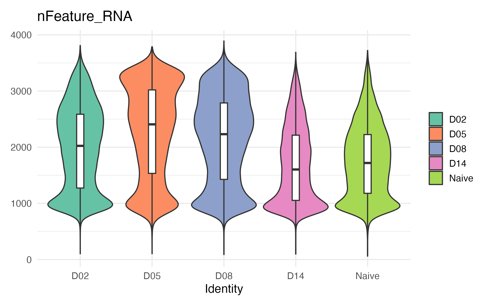

**Figure 1. Distribution of detected genes per cell (nFeature_RNA).**  
Violin plots show the number of genes detected per cell across all timepoints. Comparable distributions indicate consistent library complexity and high-quality data across conditions.

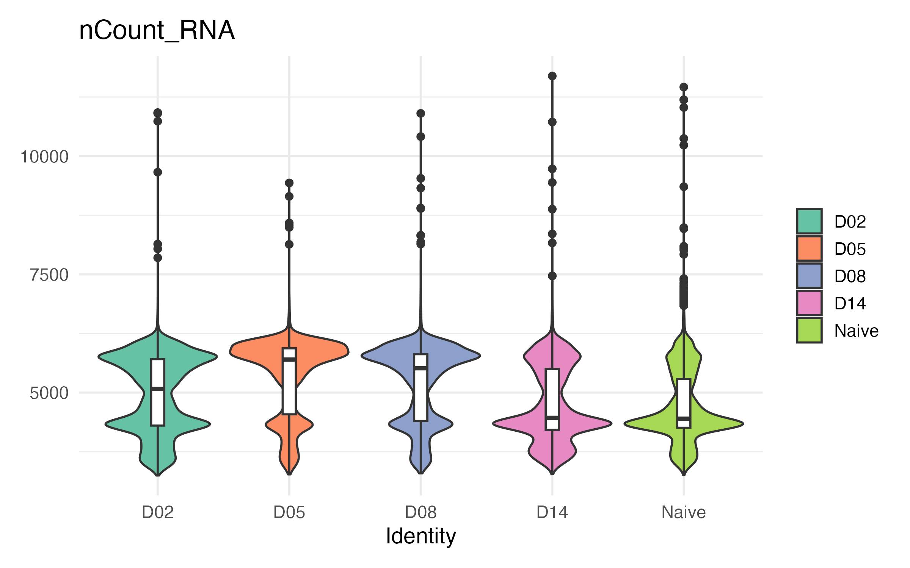

**Figure 2. Distribution of total RNA counts per cell (nCount_RNA).**  
Violin plots illustrate sequencing depth across samples. Similar distributions across timepoints suggest minimal technical variation.

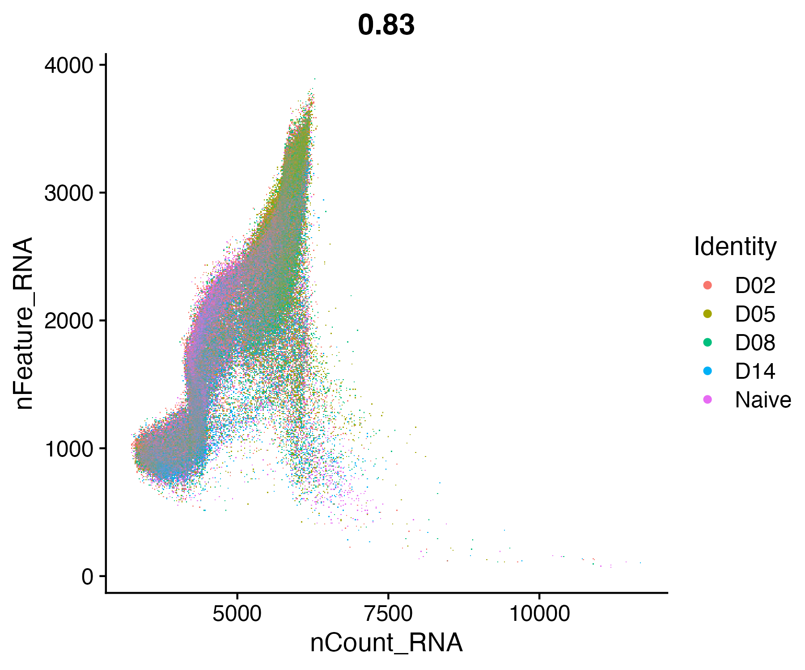

**Figure 3. Correlation between sequencing depth and gene detection.**  
Scatter plot of nCount_RNA versus nFeature_RNA shows a strong positive correlation (r = 0.827), indicating efficient gene capture and robust data quality.

### 3.2 Clustering reveals transcriptional heterogeneity

Dimensionality reduction using UMAP revealed a complex transcriptional landscape composed of multiple distinct clusters (Figure 4). These clusters represent transcriptionally heterogeneous cell populations within the respiratory mucosa.

The spatial separation between clusters suggests substantial biological diversity, while some degree of continuity between clusters indicates transitional or intermediate states. This organization reflects both discrete cell identities and continuous transcriptional variation.

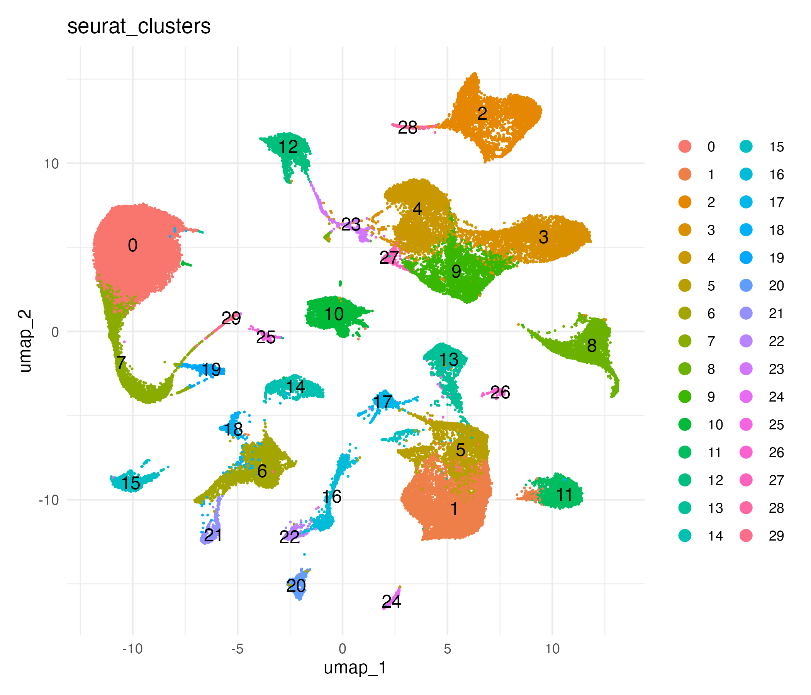

**Figure 4. UMAP visualization of unsupervised clustering.**  
Cells are grouped into transcriptionally distinct clusters based on gene expression profiles, revealing cellular heterogeneity within the dataset.

### 3.3 Cell type annotation based on canonical markers

To assign biological identities to clusters, canonical marker genes were examined. Violin plots demonstrated distinct expression patterns of key markers, including Epcam (epithelial), Cd3e (T cells), Lyz2 (myeloid), Krt13 (epithelial subset), and Cnga4 (olfactory neurons) (Figure 5). These markers showed strong specificity and minimal overlap across clusters.

Feature plots further confirmed that these markers localized to distinct regions of the UMAP embedding (Figure 7), reinforcing the spatial coherence of the identified populations. Based on these patterns, clusters were annotated into major cell types, including epithelial, IFN-responsive epithelial, myeloid, olfactory neuron, T cells, and remodeling epithelial populations (Figure 6).

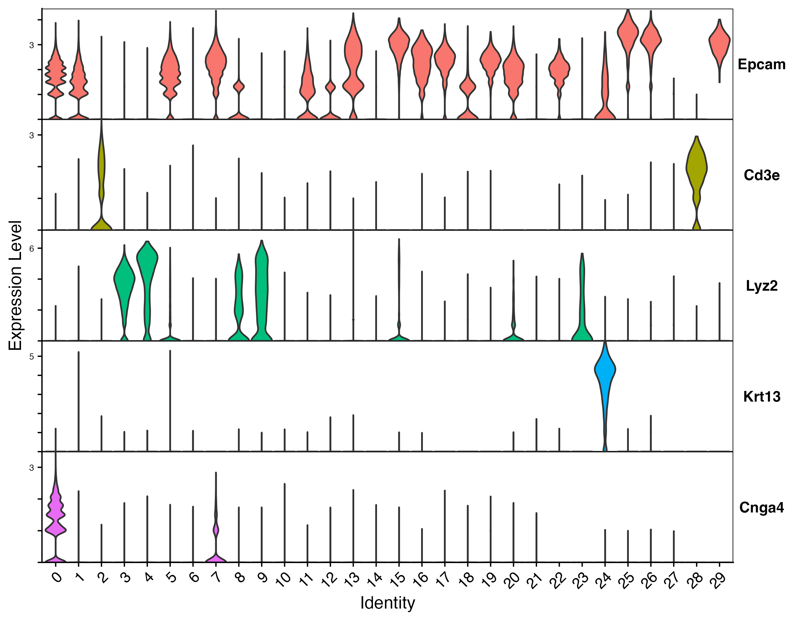

**Figure 5. Expression of canonical marker genes across clusters.**  
Violin plots show distinct expression patterns of key markers used for cell type annotation, supporting accurate classification of cell populations.

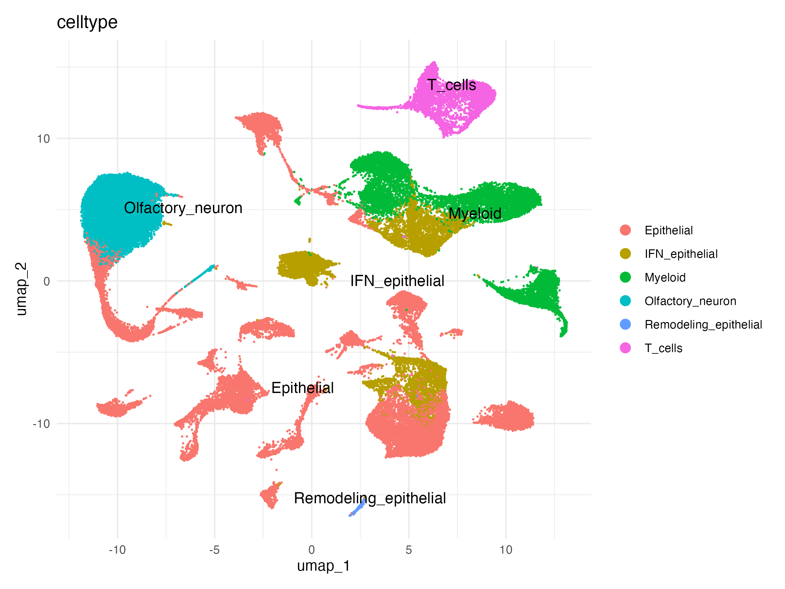

**Figure 6. UMAP visualization of annotated cell types.**  
Clusters are assigned to major biological cell types based on canonical marker expression.

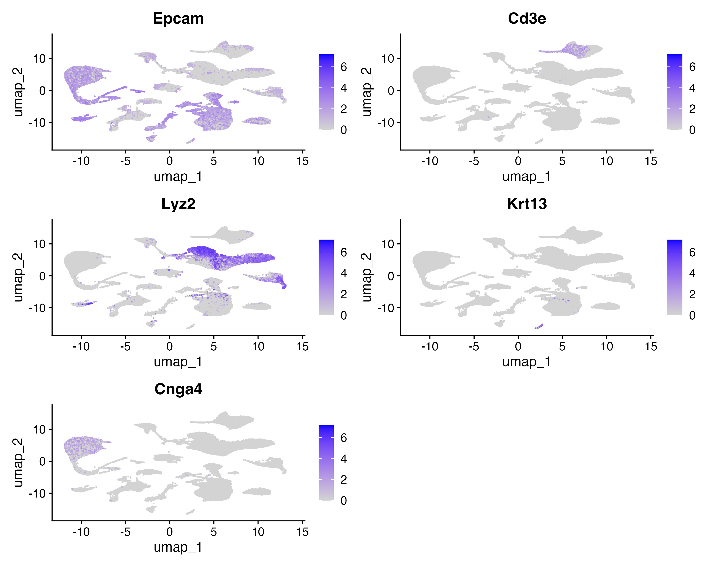

**Figure 7. Spatial distribution of marker gene expression.**  
Feature plots illustrate localization of canonical markers within the UMAP, confirming cluster identities.

### 3.4 Infection-related transcriptional programs

To investigate infection-associated responses, the expression of interferon-stimulated and immune-related genes was examined. Genes such as Isg15, Ifit1, and Rsad2 exhibited elevated expression in specific epithelial and immune clusters (Figure 8), indicating activation of antiviral signaling pathways.

Additional genes, including Cxcl16 and Cd274, displayed more localized expression patterns, suggesting roles in immune modulation and cell–cell communication. These findings highlight functional heterogeneity within epithelial populations and demonstrate that subsets of epithelial cells adopt immune-responsive transcriptional states.

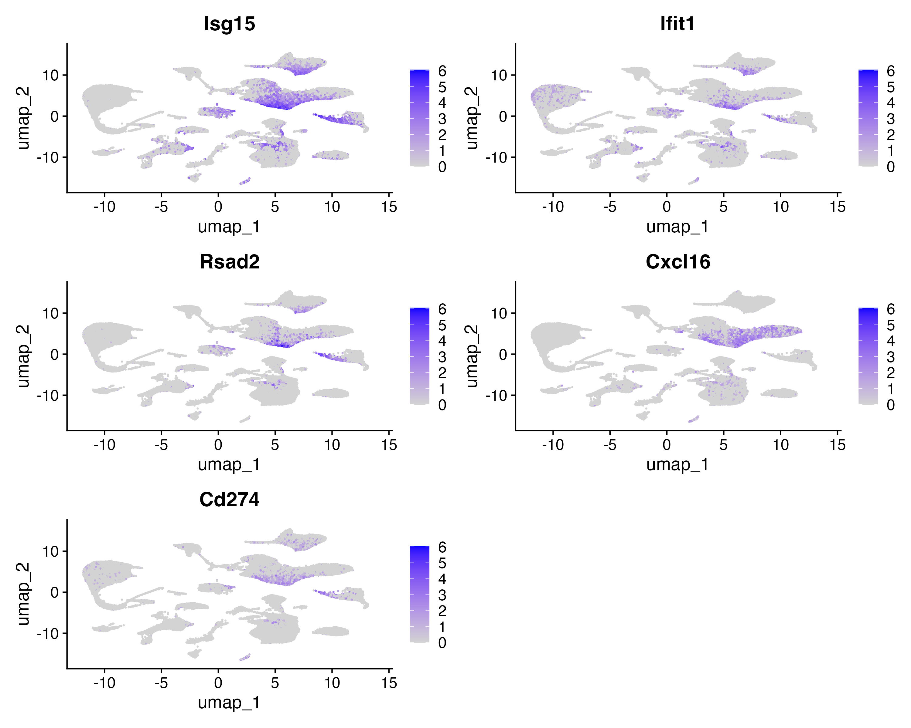

**Figure 8. Expression of infection-related genes.**  
Feature plots show expression of interferon-stimulated and immune-related genes, indicating activation of antiviral and inflammatory pathways.

### 3.5 Temporal dynamics of cluster 24

Cluster 24 was identified as a distinct epithelial subpopulation exhibiting dynamic changes over time. Its relative abundance increased from 0.38% at D02 to 1.25% at D14, followed by a decrease in the naive condition (Figure 9).

Although cluster 24 represents a small fraction of the total cell population, its consistent expansion at later timepoints suggests a biologically meaningful role. This temporal pattern is consistent with involvement in tissue remodeling or recovery processes rather than early immune activation.

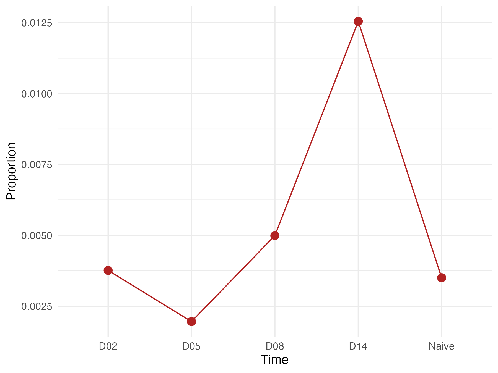

**Figure 9. Temporal dynamics of cluster 24 abundance.**  
The proportion of cluster 24 cells increases over time and peaks at D14, suggesting involvement in late-stage biological processes.

### 3.6 Functional enrichment of cluster 24

To further characterize cluster 24, Gene Ontology enrichment analysis was performed. Over-representation analysis (ORA) revealed significant enrichment of biological processes related to epidermal development, cell–cell junction organization, and wound healing (Figure 10).

Complementary GSEA analysis identified enrichment of processes such as keratinization, RNA processing, translation, and ribonucleoprotein complex biogenesis (Figure 11). The convergence of these results suggests that cluster 24 is a metabolically active epithelial population undergoing differentiation and structural remodeling.

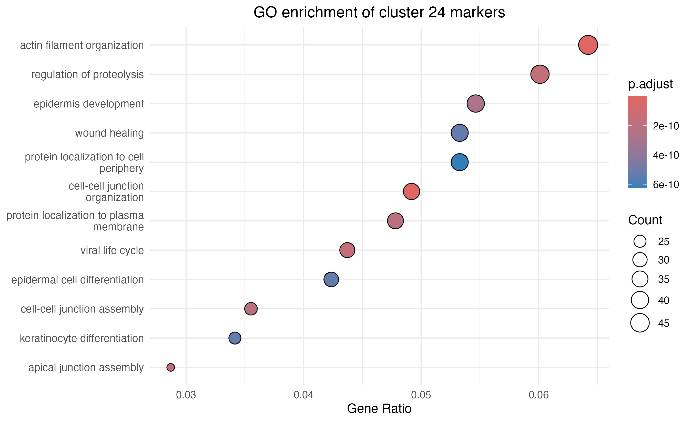

**Figure 10. GO enrichment analysis (ORA) of cluster 24 marker genes.**  
Dot plot showing significantly enriched biological processes. Dot size represents gene count, and color indicates adjusted p-values.

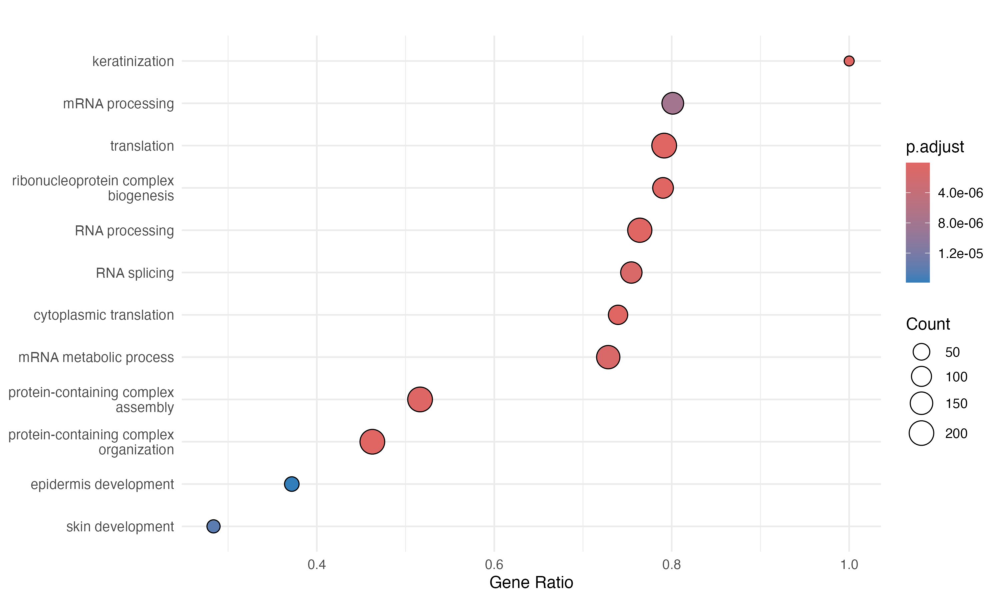

**Figure 11. GSEA of cluster 24 marker genes.**  
Gene set enrichment analysis reveals activation of pathways related to keratinization, RNA processing, and translation, indicating active epithelial remodeling.

### 3.7 Cell type composition changes over time

Analysis of overall cell type composition revealed dynamic but coordinated changes across timepoints (Figure 12). Epithelial cells remained the dominant population in all conditions, while IFN-responsive epithelial cells increased during intermediate stages (D05–D08) and declined thereafter.

Immune populations, including myeloid cells and T cells, also exhibited temporal variation, suggesting coordinated immune activation. These results indicate that infection induces both compositional and transcriptional changes within the tissue.

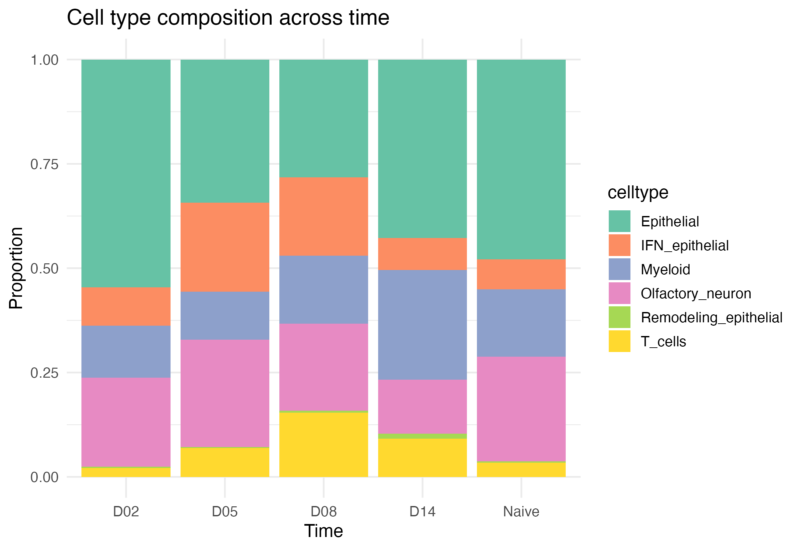

**Figure 12. Cell type composition across timepoints.**  
Stacked bar plots show relative proportions of major cell types. Temporal shifts reflect coordinated immune and epithelial responses.

### 3.8 Marker gene expression defines cluster 24 identity

Finally, the expression of representative marker genes was examined across clusters. Cluster 24 showed strong and specific expression of genes such as Krt13, Krt6b, Plet1, Csta1, Prss27, Calml3, and Pglyrp4 (Figure 13).

These genes are associated with epithelial differentiation and barrier function, further supporting the classification of cluster 24 as a specialized remodeling epithelial population.

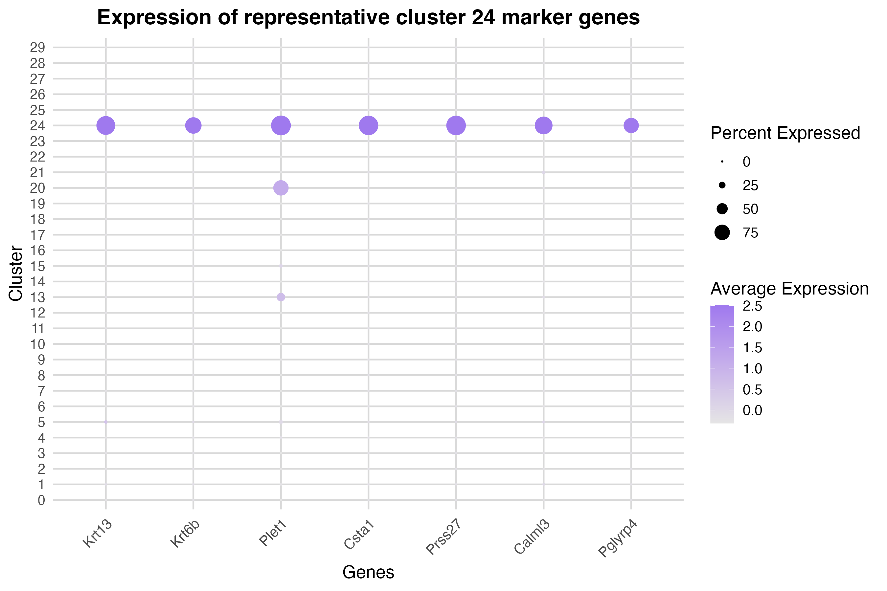

**Figure 13. Expression of representative cluster 24 marker genes.**  
Dot plot shows expression level and proportion of expressing cells across clusters. Cluster 24 displays strong enrichment of epithelial remodeling markers.

## 4. Discussion

## 5. References

